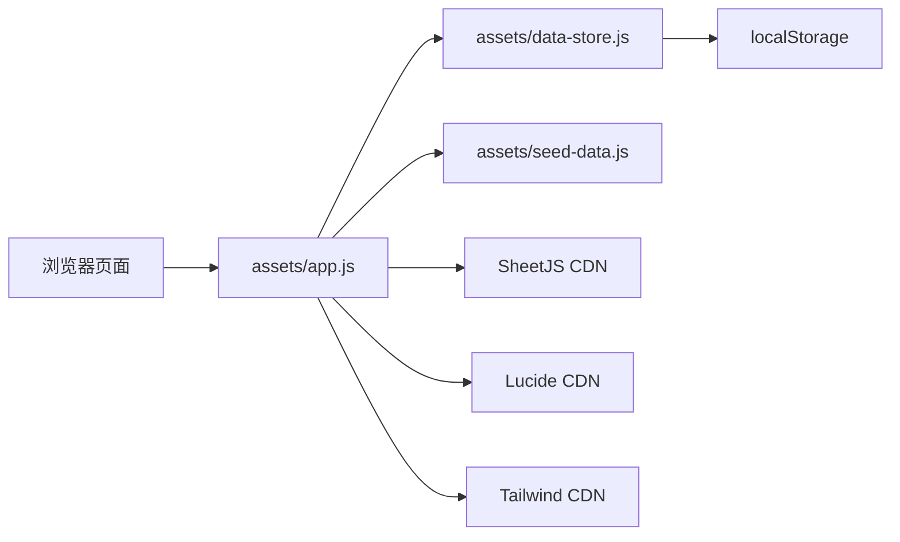

# 架构说明

## 架构概览

Ledgerforge 当前是一个纯前端单页应用。



已确认：

- 页面渲染和交互集中在 `assets/app.js`。
- 数据读写和统计计算集中在 `assets/data-store.js`。
- 初始演示数据来自 `assets/seed-data.js`。
- Excel 解析依赖浏览器端 SheetJS。
- 没有后端服务参与业务数据处理。

## 入口与加载顺序

`index.html` 负责加载：

- Tailwind CSS CDN
- Lucide 图标 CDN
- SheetJS CDN
- `assets/styles.css`
- `assets/seed-data.js`
- `assets/data-store.js`
- `assets/app.js`

应用启动后，`assets/app.js` 会：

1. 从 hash 获取当前页面。
2. 调用 `window.appStore.getState()` 获取数据。
3. 根据路由渲染对应页面。
4. 绑定全局事件委托。
5. 初始化图标。

## 路由机制

当前使用 hash 路由，没有独立路由库。

已确认的页面路由包括：

- `dashboard`
- `import`
- `import-upload`
- `import-sheets`
- `import-mapping`
- `import-preview`
- `import-errors`
- `import-confirm`
- `import-result`
- `projects`
- `project-detail`
- `grouping`
- `grouping-ungrouped`
- `grouping-suggestions`
- `grouping-preview`
- `grouping-detail`
- `reports`
- `report-result`
- `drilldown`
- `settings`
- `field-config`
- `field-preview`

## 数据层

数据层由 `window.appStore` 暴露。

已确认的数据层职责：

- 读取 localStorage。
- 在无数据或解析失败时使用 seed data 初始化。
- 写入 localStorage。
- 执行业务对象新增、编辑、删除。
- 记录操作日志。
- 计算项目和归集统计。
- 处理旧字段兼容迁移。
- 处理 Excel 解析后的数据落库。

## localStorage 数据模型

当前 localStorage key：

```text
project-finance-ledger-mvp-v1
```

主要集合：

- `imports`
- `sheets`
- `mappings`
- `projects`
- `ledger`
- `payments`
- `invoices`
- `groupings`
- `fieldDefs`
- `partners`
- `logs`

## 统计计算口径

当前代码中已确认的核心计算：

- 台账金额：`数量 * 单价`
- 项目收入：项目下 `type = 收入` 的台账金额合计
- 项目支出：项目下 `type = 支出` 的台账金额合计
- 项目毛利：收入减支出
- 已收：项目下 `direction = 收款` 的收付款金额合计
- 已付：项目下 `direction = 付款` 的收付款金额合计
- 应收：`max(收入 - 已收, 0)`
- 应付：`max(支出 - 已付, 0)`
- 归集收入：归集项目包含的项目收入合计
- 归集支出：归集项目包含的项目支出合计
- 归集毛利：归集收入减归集支出

## Excel 导入架构

Excel 导入在浏览器端完成。

已确认流程：

1. 用户上传 `.xlsx`、`.xls`、`.csv` 或 `.tsv` 文件。
2. SheetJS 解析工作簿。
3. 系统识别 Sheet 和表头。
4. 用户选择需要导入的 Sheet。
5. 系统按映射规则将表格列映射为系统字段。
6. 用户预览导入结果。
7. 用户查看并确认解析问题的处理方式。
8. 用户确认导入。
9. 数据写入 localStorage。
10. 记录导入日志。

字段映射优先使用系统维护的 `mappings`。

当前导入流程不做项目归集。项目归集由统计归集模块处理。

## 事件与交互结构

当前页面交互主要通过事件委托实现：

- 全局点击事件处理按钮、导航、删除、弹窗操作。
- 全局提交事件处理表单保存。
- 全局输入事件处理搜索、金额计算、表单联动。
- 全局变更事件处理文件上传、Sheet 选择、复选框。

弹窗能力已确认包括：

- 关闭按钮
- 取消按钮
- 保存按钮
- 遮罩点击不关闭
- 标题栏拖动
- 拖动范围限制在浏览器可视区域内

## 日志结构

当前操作日志至少包含：

- 时间
- 用户
- 模块
- 操作
- 对象
- 结果
- 错误原因

用户字段目前固定为 `预留用户`。

## 信任边界

当前所有业务逻辑运行在浏览器中。

需要注意：

- 用户可以直接修改 localStorage。
- 没有服务端校验。
- 没有权限隔离。
- Excel 文件解析依赖外部 CDN。
- Tailwind 和 Lucide 也依赖外部 CDN。

## 已知架构限制

- 没有后端和数据库。
- 没有自动化测试。
- 没有构建系统。
- 没有依赖锁文件。
- `lucide@latest` 是浮动版本。
- 字段配置可以维护字段定义，但主要业务表格仍以代码中的固定列为主，不是完全动态字段系统。
- 多用户、并发编辑、权限审计未实现。

## 未知项

- 正式部署方式未知。
- 浏览器兼容范围未知。
- 数据备份方案未知。
- 远程仓库发布状态未知。
- 生产环境安全策略未知。
